### Название ПО: [RasMol](http://www.openrasmol.org/)
### Белок: [8P67](https://www.rcsb.org/structure/8P67)

### Wireframe
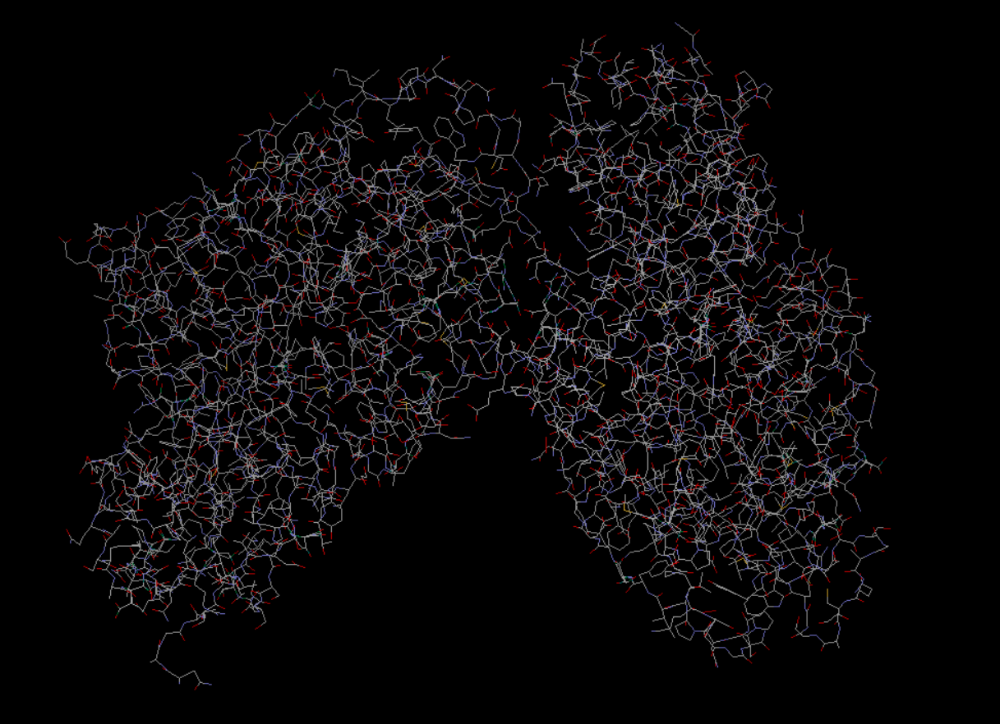

### Backbone
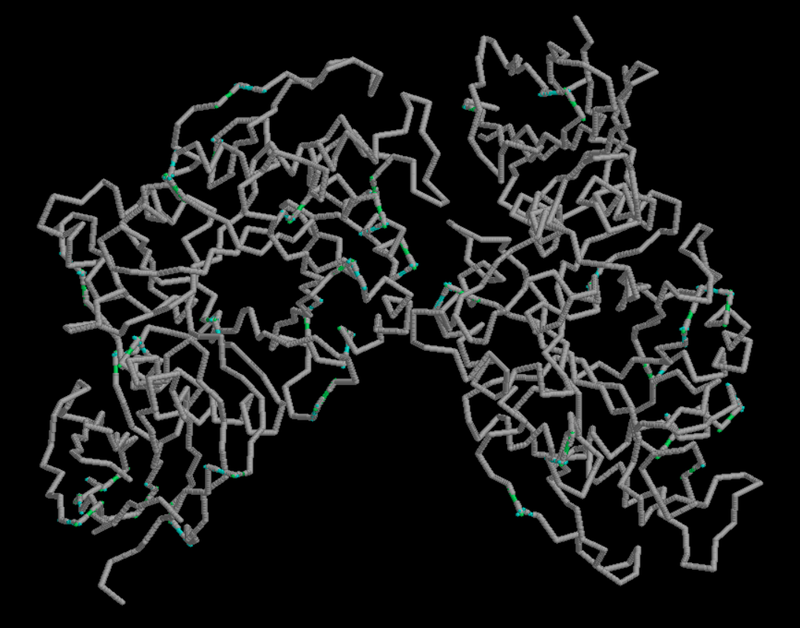

### Spacefill
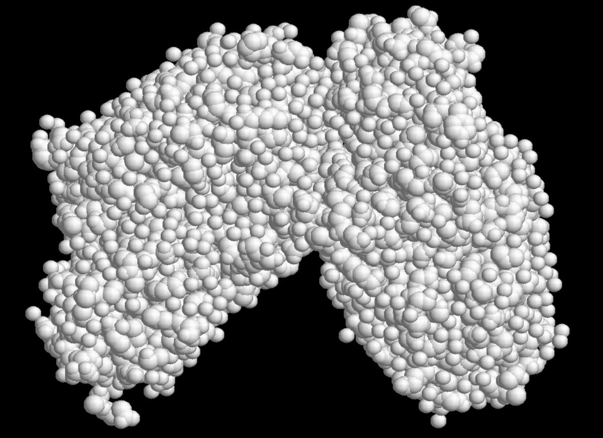

### Ribbons
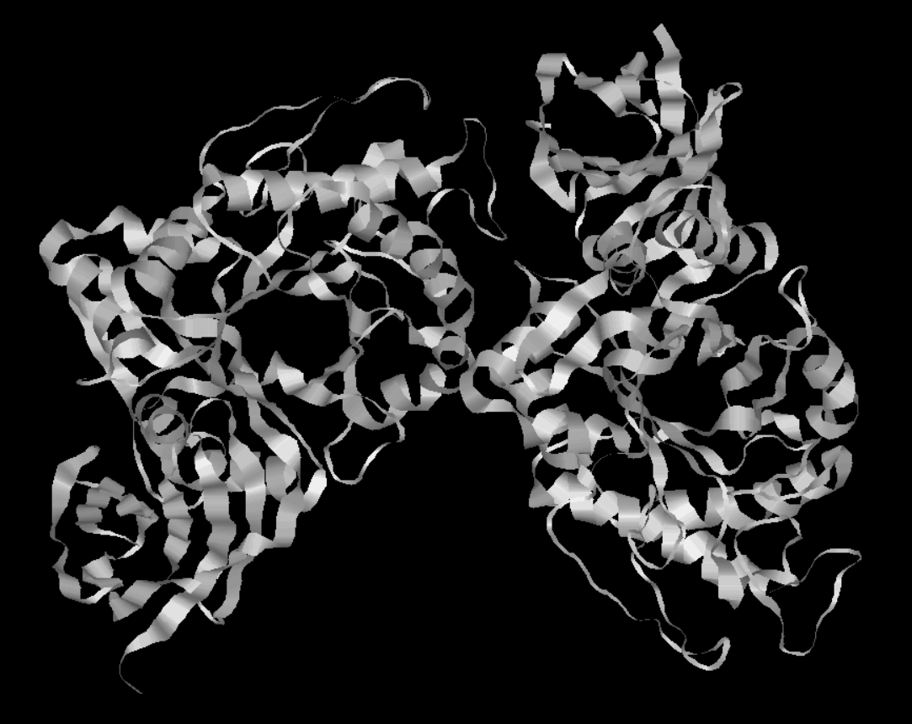

### Molecular surface
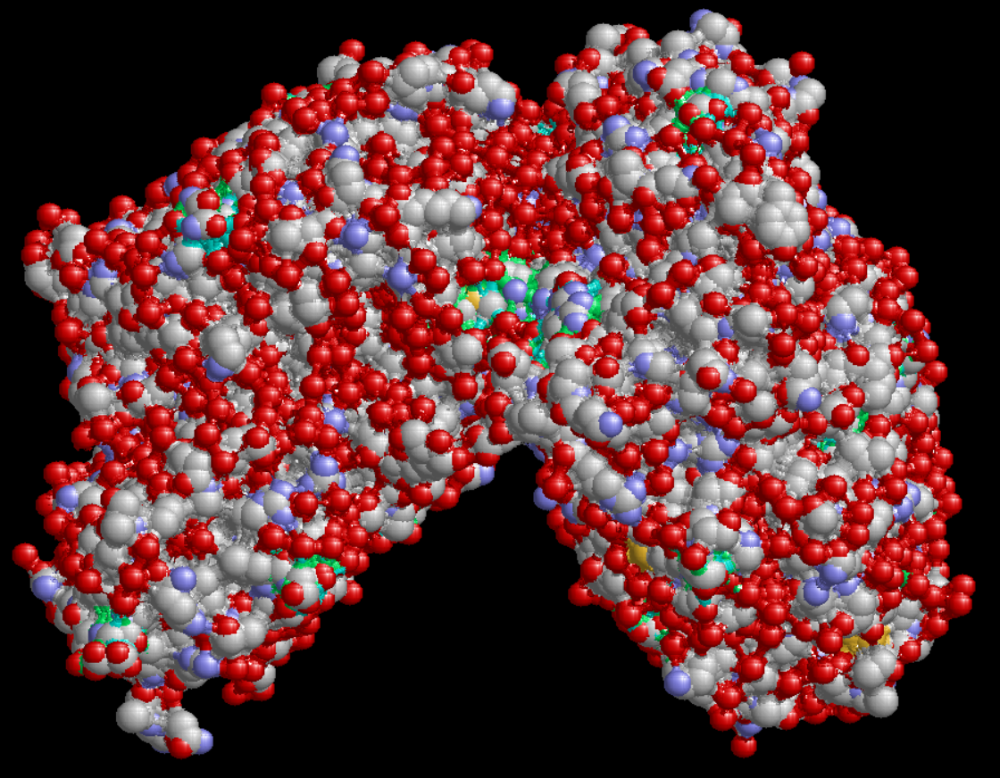

### Цветовая модель CPK
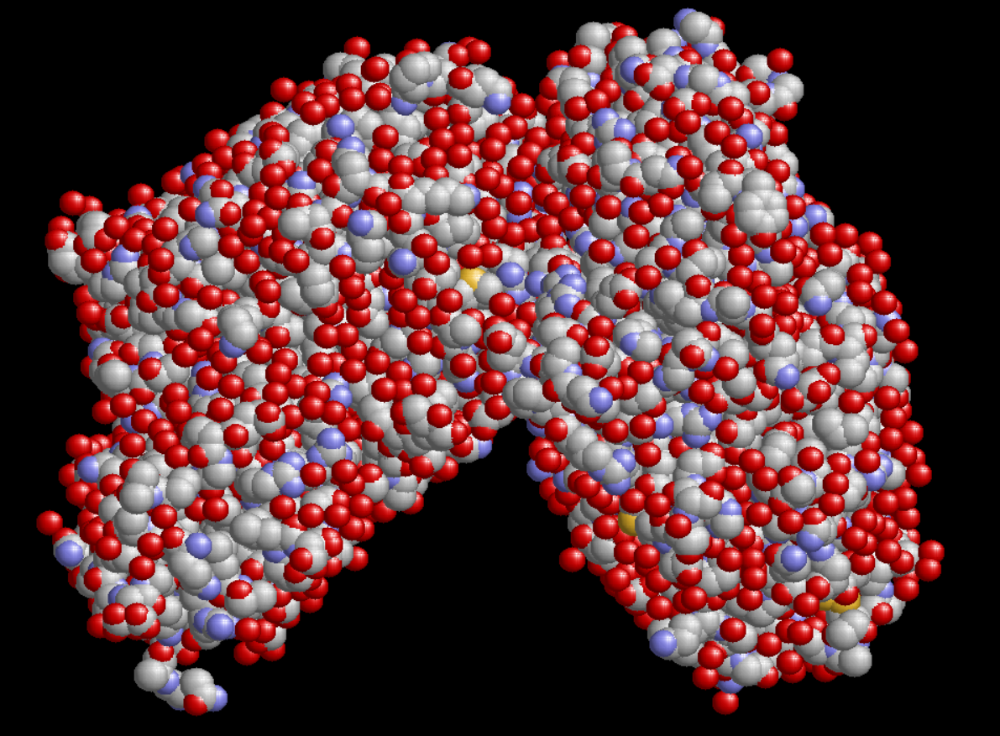

Представление - `Spacefill`, цвет - `CPK`

### Различные цвета по доменам (частям) белка
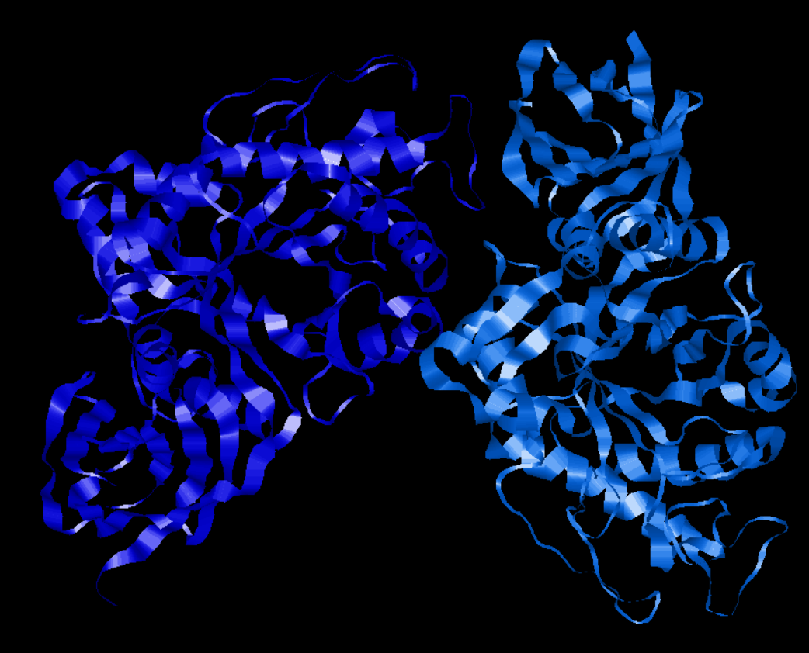

Представление - `Ribbons`, цвет - `Chain`

### Для получения визуализации:
- пользовался интерфейсом приложения 

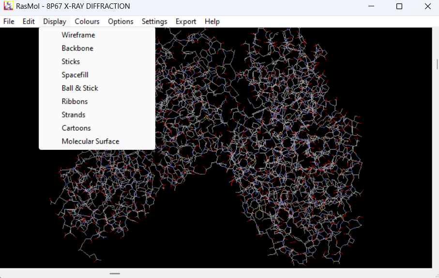

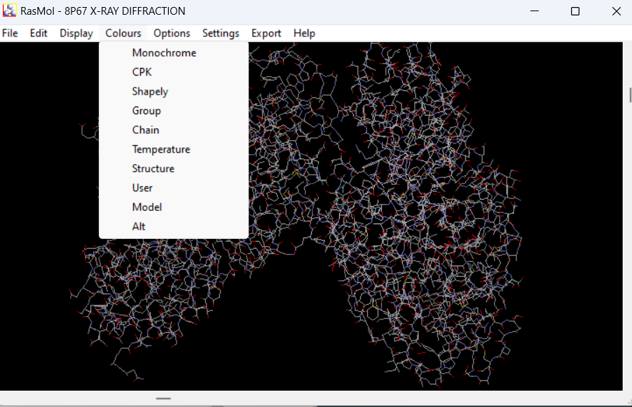

- и также пользовался командной строкой приложения

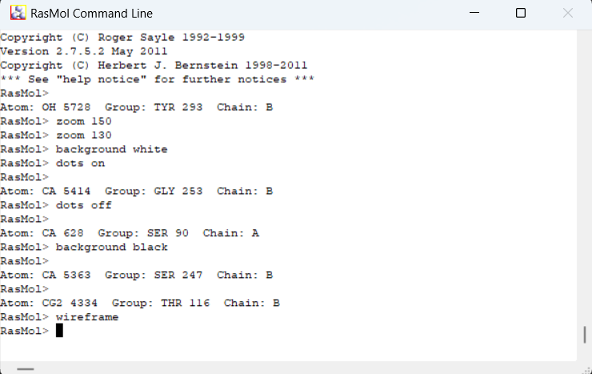

### Изображение белка публикационного качества

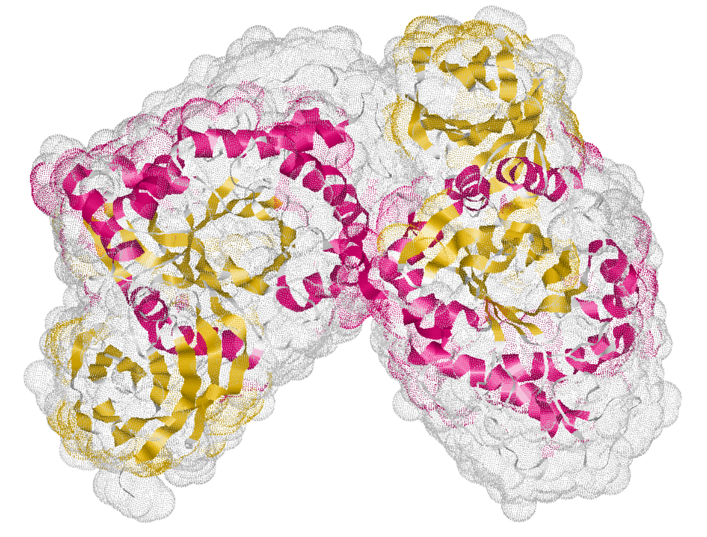

Для получения изображения публикационного качества использовал представление `ribbons`, цвет - `Structure`, включил в коммандной строке `dots on` для поверхности Ван-дер-Ваальса, `zoom 130` для приближения и `background white` для фона белого света